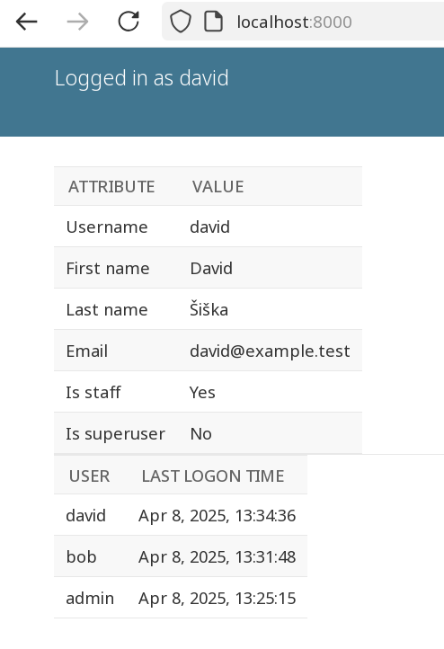

# Django activity application

Example application to visualize logon / logout process
and information about users. It can be used to debug or test
more complex authentication mechanisms.

The application shows the last 20 users that logged in,
after logon it shows user's attributes.

